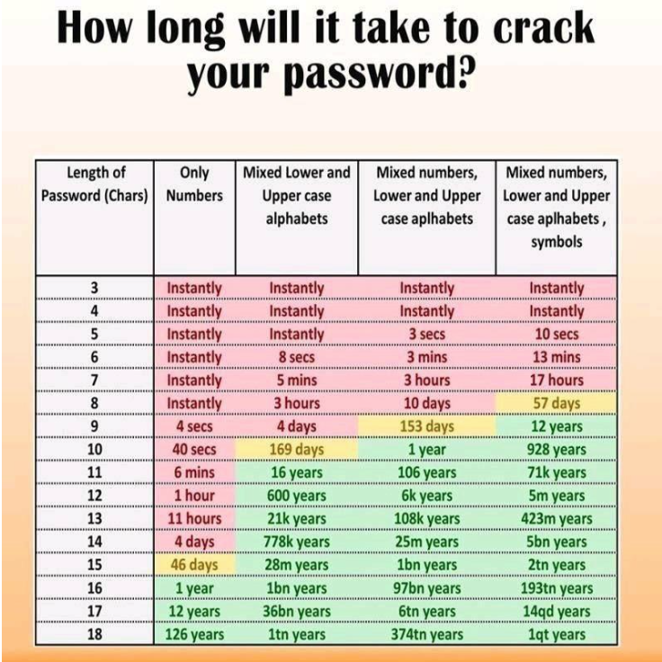
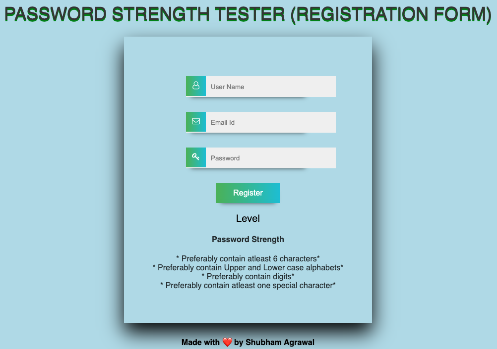

# Password-Strength-Checker-Registration-Form

A password strength checker which can indicate the strength of the password that the user has entered.
This can help the user know if the password which the user wants to set is :
1. Too weak
2. Weak
3. Mediocre
4. Strong
5. Very strong

###  Weak passwords can easily be cracked by brute force attack.

In cryptography, a brute-force attack consists of an attacker submitting many passwords or passphrases with the hope of eventually guessing correctly. The attacker systematically checks all possible passwords and passphrases until the correct one is found.

This poses a security threat for all users and thus setting a strong password which cannot be cracked easily is important.

